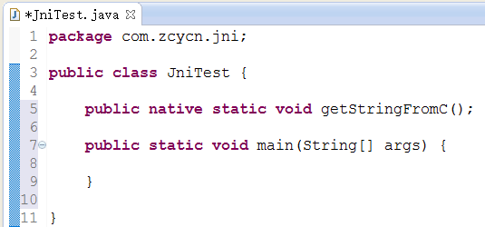
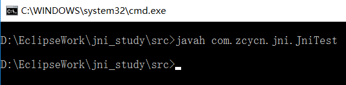
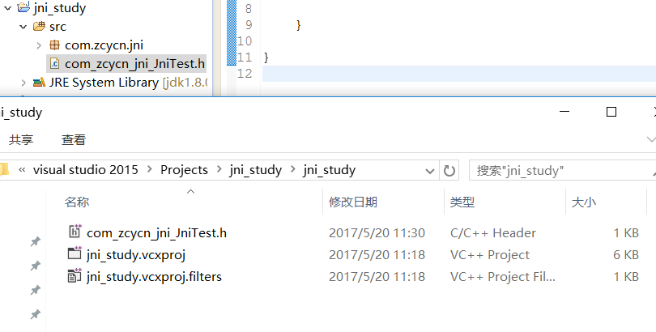
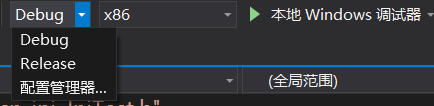
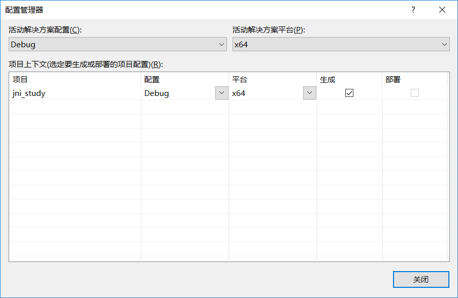
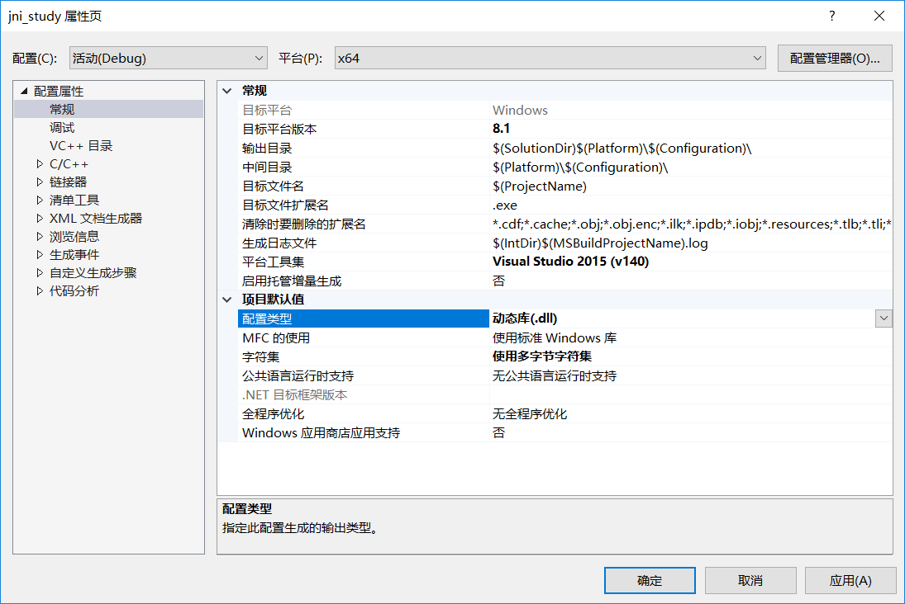
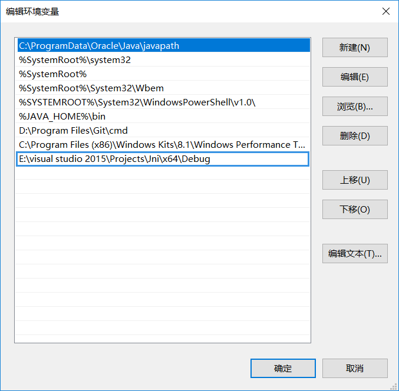

### 预编译指令

> C执行流程，编译obj目标代码，连接，将目标代码与C函数库连接合并，形成可执行文件
> 预编译，为编译做准备，完成代码文本替换

比如#include引入头文件

1. define   

定义标示       
        
    #ifdef __cplusplus 标识支持c++语法    
        
    防止文件重复引入   
    #ifndef AH // 如果没有定义AH
    #define AH // 那么定义AH
    ...
    #endif 

    A.h文件
    #ifndef AH
    #define AH
    #include "B.h"

    void printfA();

    #endif

    B.h文件
    #ifndef BH
    #define BH
    #include "A.h"

    void printfB();

    #endif

    // 使用时就不会重复引用
    #include "A.h"

    void printfA(){

    }

    // A.h头文件新的定义方法
    // 新版本的宏定义，让编译器自动处理循环包含问题
    #pragma once
    #include "B.h"
    void printfA();

定义常数    

    #define MAX 100
    if(i < MAX){

    }

定义宏函数

    void dn_com_jni_read(){
        
    }

    void dn_com_jni_write(){
        
    }

    #define jni(NAME) dn_com_jni_##NAME();

    // 调用
    jni(read);

Android中日志输出

    // __VA_ARGS__ 可变参数
    #define LOG(FORMAT,...) printf(FORMAT,__VA_ARGS__);
    // 使用
    LOG("%s%d","大小：",89);

    // 日志加级别
    #define LOG_I(FORMAT,...) printf("INFO:"); printf(FORMAT,__VA_ARGS__);
    LOG_I("%s%d","大小：",89);// 输出会多个info：

    // 升级版
    #define LOG(LEVEL,FORMAT,...) printf(LEVEL); printf(FORMAT,__VA_ARGS__);
    #define LOG_I(FORMAT,...) LOG("INFO",FORMAT,__VA_ARGS__);
    #define LOG_E(FORMAT,...) LOG("ERROR",FORMAT,__VA_ARGS__);

    > 这边##可加也可不加，都表示替换，后面是任意名字

### JNI

- jni步骤    

1. 编写native方法      

        

2. javah命令生成.h头文件      

        

3. 复制.h头文件到cpp工程     

        
    文件复制到工程下，还需要在vs工程头文件下添加现有项      
    将jni.h和jni_md.h从jdk中也拷贝到cpp工程        
    生成头文件中的#include <jni.h>需要改为#include "jni.h"，由于这里头文件不是引用的系统的       

4. 实现.h头文件中声明的函数    

        #include "com_zcycn_jni_JniTest.h"

        JNIEXPORT jstring JNICALL Java_com_zcycn_jni_JniTest_getStringFromC
        (JNIEnv *env, jclass jcls) {
            // c字符串转java字符串
            return (*env)->NewStringUTF(env, "C String");
        }

5. 生成dll文件

         
         
                 
    生成->生成解决方案      
    在工程目录下找到dll文件       

6. 配置dll文件环境变量

    新配置的环境变量，需要重启Eclipse，或拷贝到工程根目录下
        

7. 调用native方法，运行

        package com.zcycn.jni;

        public class JniTest {

            public native static String getStringFromC();
            
            public static void main(String[] args) {
                System.out.println(getStringFromC());
            }
            
            // 加载动态库
            static{
                System.loadLibrary("jni_study");
            }
            
        }    

    > dll动态库，a静态库，打包的exe中是不包含dll的

- JNIEnv    

JNIEnv结构体指针，代表java运行环境，调用java中的代码       
c++中可以通过this获取当前的指针     
c中需要用到自身，那么传递结构体的指针，那么接收这个指针就必须是二级指针   
指针赋值给指针必须是二级指针      

    // 结构体指针别名
    typedef struct JNINativeInterface_ *  JNIEnv;

    struct JNINativeInterface_ {
        // 定义结构体中指针函数，模拟JNIEnv
        char* (*NewStringUTF)(JNIEnv*, char *);
    };

    char* NewStringUTF(JNIEnv* env, char * str) {
        return str;
    }

    void main() {
        // 实例化结构体
        struct JNINativeInterface_ struct_env;
        struct_env.NewStringUTF = NewStringUTF;

        // 结构体指针
        JNIEnv e = &struct_env;

        // 结构体二级指针
        JNIEnv *env = &e;

        (*env)->NewStringUTF(env, "abc");
        
        system("pause");
    }

- jclass

代表native方法所属类的class对象

- jobject

native方法是非静态方法，native方法所属的对象

	public native static String getStringFromC();
	public native String getString2FromC();

    JNIEXPORT jstring JNICALL Java_com_zcycn_jni_JniTest_getStringFromC
    (JNIEnv *env, jclass jcls) {
        // c字符串转java字符串
        return (*env)->NewStringUTF(env, "C String");
    }

    JNIEXPORT jstring JNICALL Java_com_zcycn_jni_JniTest_getString2FromC
    (JNIEnv *env, jobject jobj) {
        return (*env)->NewStringUTF(env, "C String");
    }

### jni数据类型

修改java属性值

    JNIEXPORT jstring JNICALL Java_com_zcycn_jni_JniTest_accessField
    (JNIEnv *env, jobject jobj) {
        // 获取jclass
        jclass cls = (*env)->GetObjectClass(env, jobj);
        // 获取属性ID	属性名称	属性签名	object	就是L开头加类名分号
        jfieldID fid = (*env)->GetFieldID(env, cls, "key", "Ljava/lang/String;");
        // 获取属性值
        jstring jstr = (*env)->GetObjectField(env, jobj, fid);
        // jstring转c字符串 isCopy是否复制 JNI_FALSE
        char *c_str = (*env)->GetStringUTFChars(env, jstr,NULL);
        char text[20] = "super ";
        strcat(text, c_str);
        // c字符串转jstring
        jstring new_jstr = (*env)->NewStringUTF(env, text);
        // 修改key
        (*env)->SetObjectField(env, jobj, fid, new_jstr);

        return new_jstr;
    }

    package com.zcycn.jni;

    public class JniTest {

        public native static String getStringFromC();
        
        public native String getString2FromC();
        
        public String key = "hello";
        
        /**
        * 返回修改后的属性内容
        * @return
        */
        public native String accessField();
        
        public static void main(String[] args) {
            System.out.println(getStringFromC());
            
            JniTest j = new JniTest();
            System.out.println(j.getString2FromC());
            System.out.println("key:修改前："+j.key);
            System.out.println(j.accessField());
            System.out.println("key:修改后："+j.key);
        }
        
        // 加载动态库
        static{
            System.loadLibrary("jni_study");
        }
        
    }

