### 安装VMware

这里是通过baidu搜索下载的目前最新版12.5.6，默认下一步安装即可  
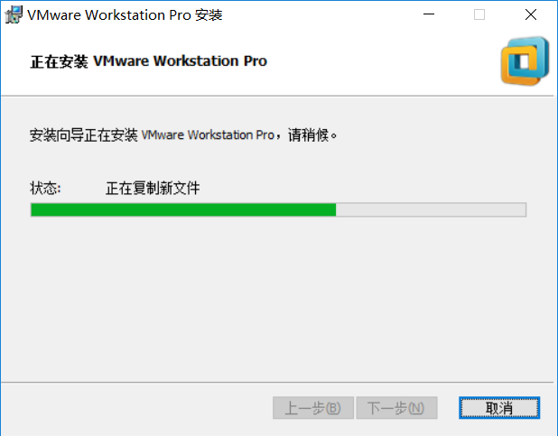   
在跳出输入密钥页面，不选择跳过，这里在网上找个密钥输入一下http://www.zdfans.com/5928.html    
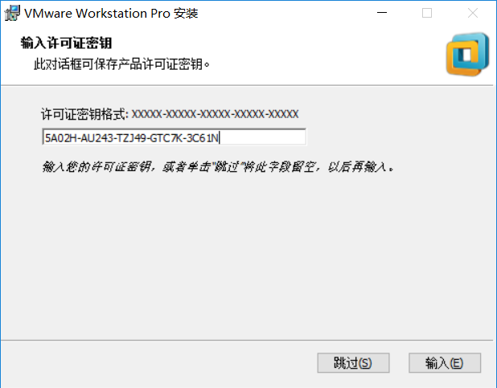   
安装完成后打开，发现已经可以永久使用  
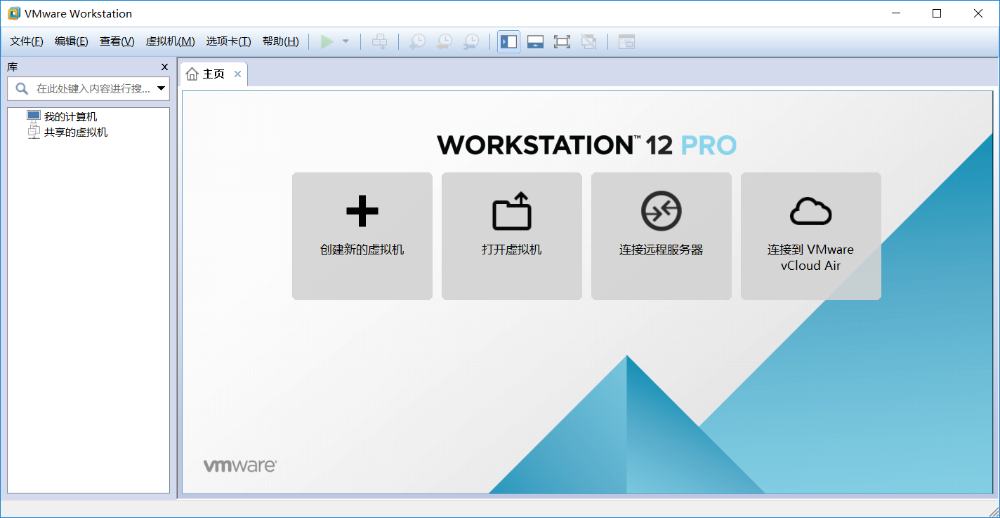    
VM的安装这里就算完成了    

### 安装Ubuntu

Ubuntu这里使用的官网最新版Ubuntu 16.04 LTS    
由于我们仅仅是使用Ubuntu，所以在虚拟机安装时并不关心细节，这里使用VMware为我们提供的简易安装步骤，基本时默认配置，安装过程可能比较长    
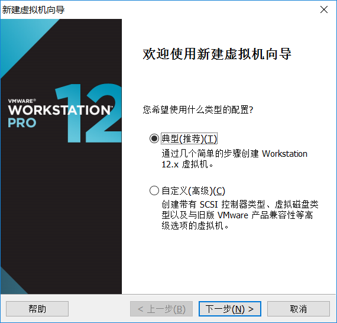    
选择Ubuntu IOS路径  
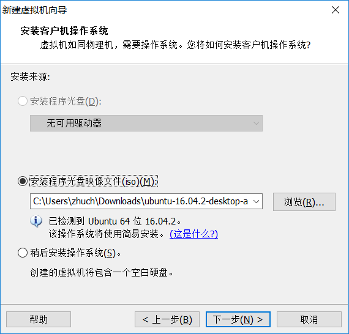    
VMware会为我们在系统中自动设置用户名密码，这里把需要设置的用户名密码设置好    
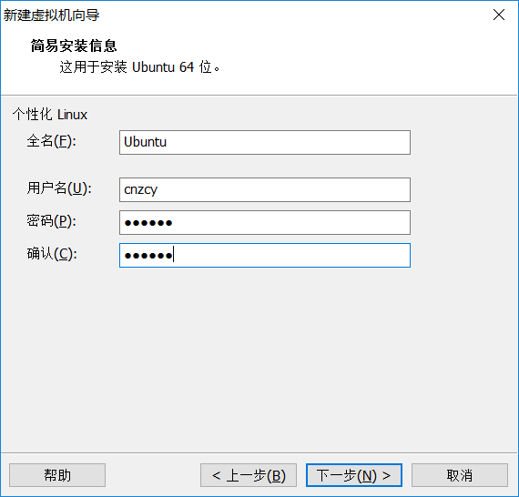   
安装完成    
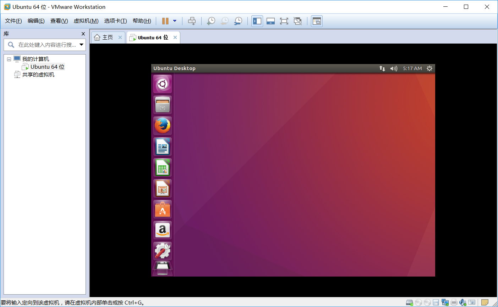   

### 安装ssh服务

为了模拟远程Linux服务器，使用Xshell和Xftp，这里就要安装ssh服务了   
通过两条命令，即可联网安装   
打开"终端窗口"，输入"sudo apt-get update"-->回车-->"输入当前登录用户的管理员密码"    
打开"终端窗口"，输入"sudo apt-get install openssh-server"-->回车-->输入"y"-->回车-->安装完成       
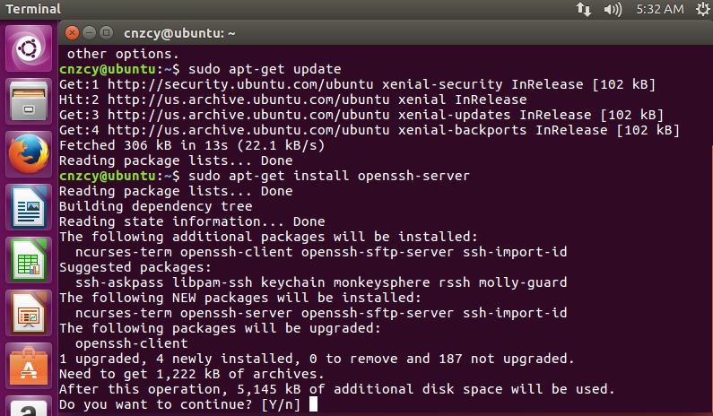   
查看ssh服务是否启动     
打开"终端窗口"，输入"sudo ps -e |grep ssh"-->回车-->有sshd,说明ssh服务已经启动，如果没有启动，输入"sudo service ssh start"-->回车-->ssh服务就会启动       
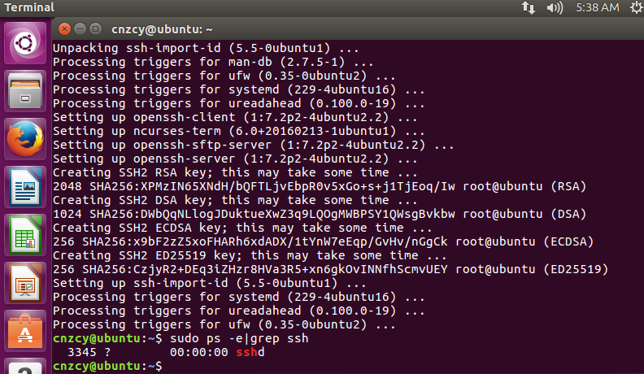   

### 安装Xshell和Xfip

这两个应用时一体的，只要配置好Xshell，即可通过Xshell中按钮打开Xftp自动远程连接     
Xftp是与Xshell配套使用的，通过Xshell中新建文件传输打开直接进入     
这里使用了Xshell_5.0.0.37这个版本，下载地址：http://download.csdn.net/download/sinsiwoo/9666169    
Xftp通过百度下载      
安装下一步，选择非商用的即可      

虚拟机使用的NAT共享的网络，需要配置映射关系，才能远程连上      
在配置前检查VMware在系统的防火墙权限       
通过编辑打开编辑虚拟网络        
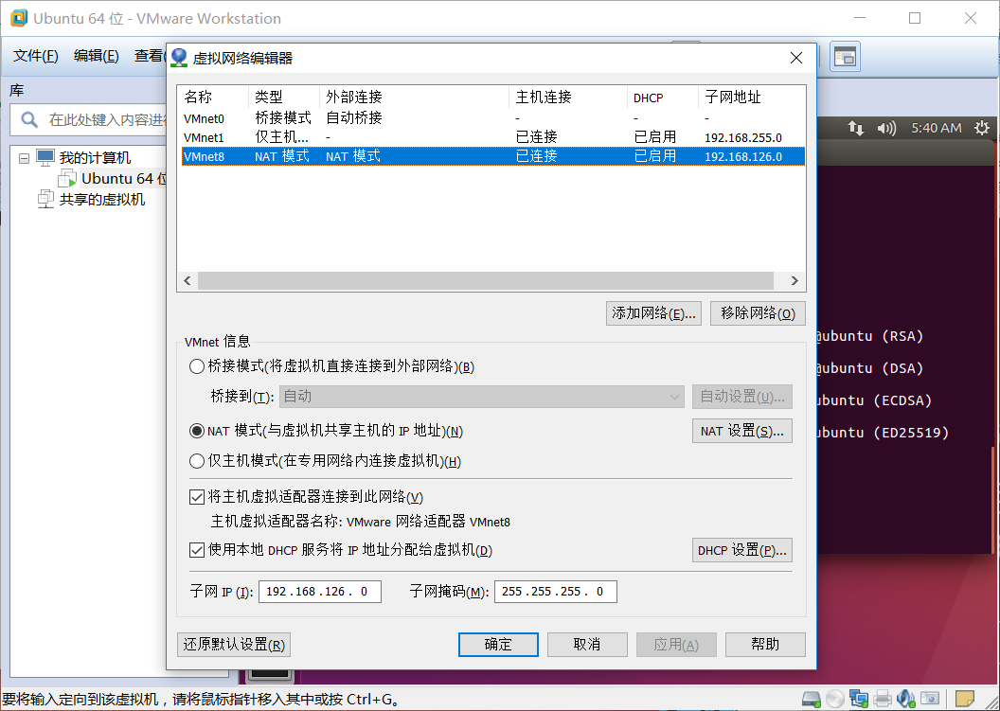   
设置主机映射的端口，虚拟机IP和端口  
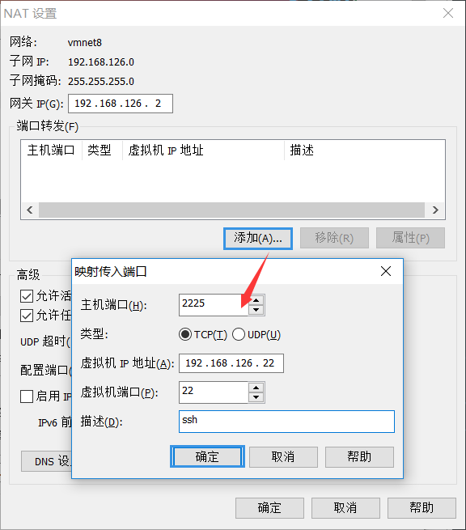   
添加完确定       
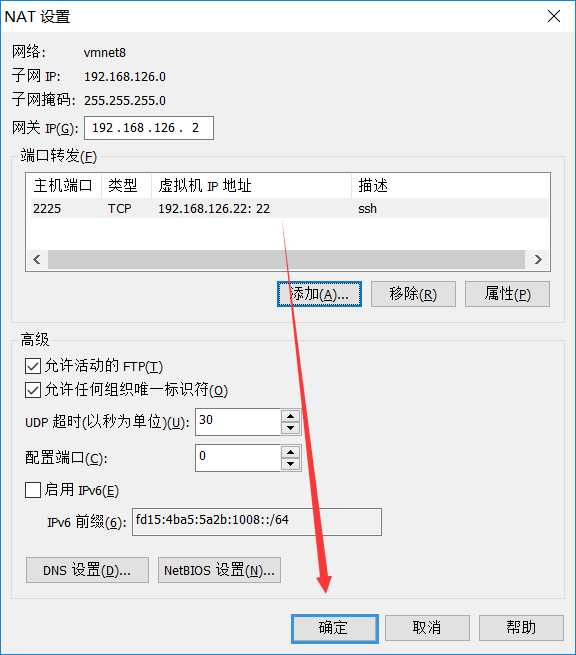   
打开Xshell配置远程IP和端口   
远程IP输入本机IP和映射的端口    
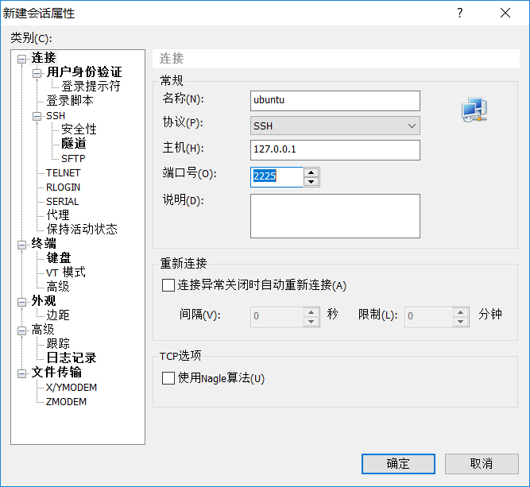   
在系统提示连接的时本地计算机时，通过下面步骤连接    
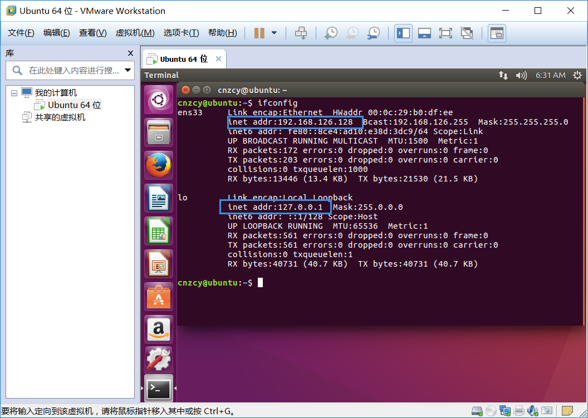   
按上图中系统分配的IP     
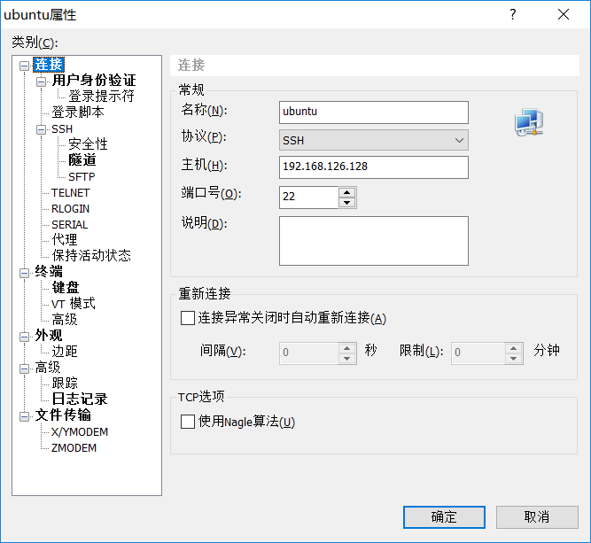   
这时成功连上  
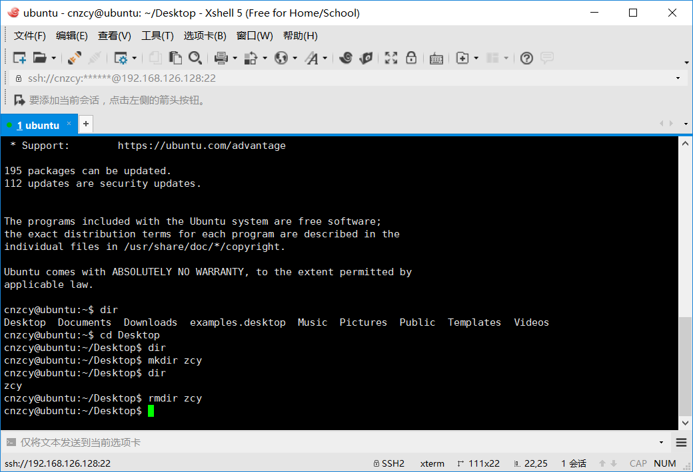   
> 端口映射的两种情况，是在我的两个不同电脑上发现的，具体可能根操作系统相关，后续补充       

参考资源：   
>http://jingyan.baidu.com/article/9c69d48fb9fd7b13c8024e6b.html    关于安装ssh服务
http://www.linuxidc.com/Linux/2016-09/135366.htm     通过端口映射
