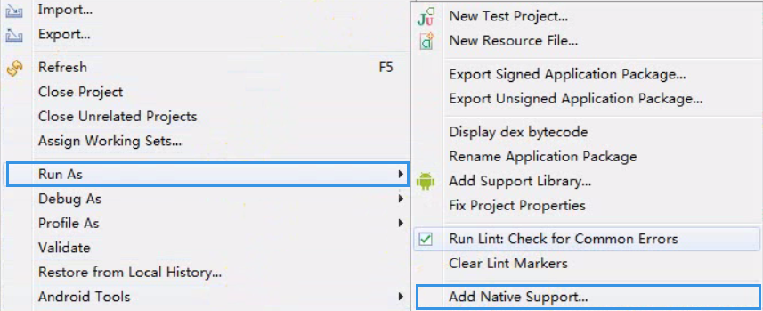
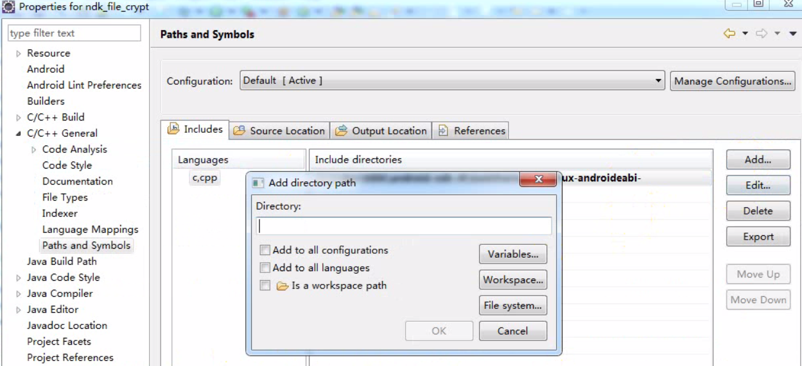

### Eclipse下NDK开发流程

1. 编写java Native方法
2. javah生成头文件
3. 创建jni目录      
        与src同目录下
4. 添加本地支持
               
5. Eclipse下Android中配置NDK路径
6. C/C++ General中配置ndk头文件路径     
        J:\dev\NDK\android-ndk-r9\toolchains\arm-linux-androideabi-4.6\prebuilt\windows-x86_64\lib\gcc\arm-linux-androideabi\4.6\include
        J:\dev\NDK\android-ndk-r9\toolchains\arm-linux-androideabi-4.6\prebuilt\windows-x86_64\lib\gcc\arm-linux-androideabi\4.6\include-fixed
        J:\dev\NDK\android-ndk-r9\platforms\android-18\arch-arm\usr\include  
               
7. 配置完在jni下会自动生成Android.mk文件    
8. 多平台支持需要配置Application.mk
