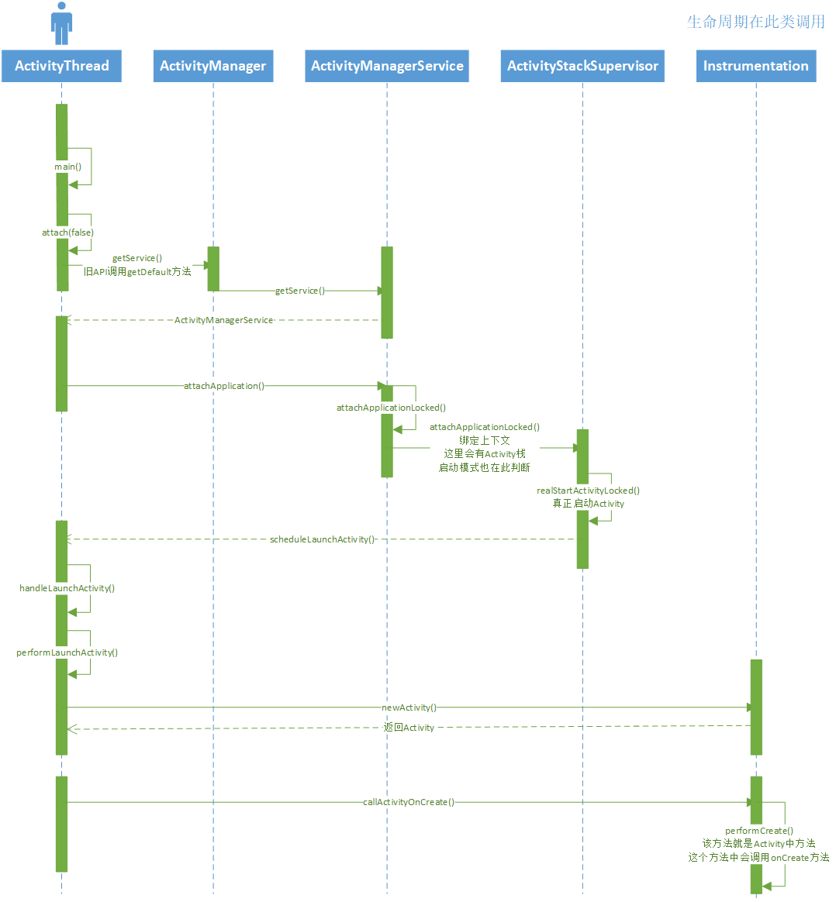

### Activity启动流程  

- ActivityThread类中包含了App启动的入口main方法，方法中经过一些列初始化，绑定上下文、创建消息队列

- 主线程在main()方法中已经调用prepare和loop，所以handler可以直接接收消息。如果子线程中接收消息需要自行looper  

        @Override
        protected void onCreate(Bundle savedInstanceState) {
            super.onCreate(savedInstanceState);
            setContentView(R.layout.activity_main);

            new Thread(){
                @Override
                public void run() {
                    Looper.prepare();
                    mHandler = new Handler(){
                        @Override
                        public void handleMessage(Message msg) {
                            super.handleMessage(msg);
                            System.out.println("======" + msg.arg1);
                        }
                    };
                    Message message = Message.obtain();
                    message.arg1 = 1;
                    mHandler.sendMessage(message);
                    Message message2 = Message.obtain();
                    message2.arg1 = 2;
                    mHandler.sendMessage(message2);
                    Message message3 = Message.obtain();
                    message3.arg1 = 3;
                    mHandler.sendMessage(message3);
                    Looper.loop();
                }
            }.start();
        }

- 下面时序图列举了APP启动经历的主要方法和返回值  

               