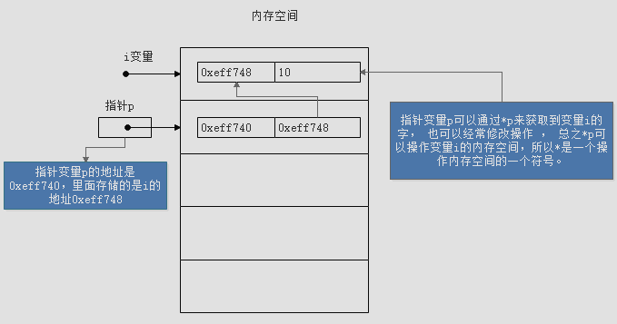
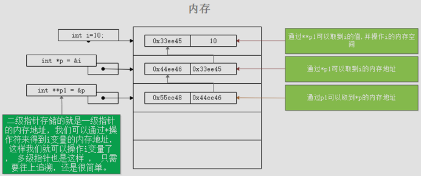

## 1、基本数据类型

    int short long float double char

格式化输出

    int %d        short %d    long %ld
    float %f      double %lf
    char %c 
    %x 16进制     %o 8进制     %s 字符串     %#x 地址

窗口执行完不关闭

    system("pause");

## 2、指针

指针只能存储地址，通过*p可操作指针所指变量的值

    int i = 100;    
    // 定义指针并赋值
    int *p = &i;

    

指针也可以运算，比如p++操作，因为数组存储数据的内存空间是连续的 

    int ids = {0, 1, 2, 3, 4, 5};
    int *p = ids;
    int i = 0;
    for(; p< ids+5; p++){
        *p = 10;
    }

## 3、指针函数

二级指针

    int i = 10;
    // p指针变量存储的是i的内存地址
    int* p = &i;
    // p1指针变量存储的是p的内存地址
    int** p1 = &p;

    

函数指针定义：返回类型、函数指针名、参数列表（参数名可省略）

    // char指针表示使用字符串
    void msg(char* msg, char* title){
        MessageBox(0, msg, title, 0);
    }

    void main(){
        // 定义函数指针
        void(*fun)(char* msg, char* title) = msg;
        // 调用
        fun("title", "content");
    }

函数指针在函数中调用

    int add(int a, int b){
        return a+b;
    }

    int minus(int a, int b){
        return a-b;
    }

    void msg(int(*fun_p)(int a, int b), int a, int b){
        // 调用函数指针
        int res = fun_p(a, b);
        printf("%d\n", res);
    }

    void main(){
        msg(add, 1, 2);
        msg(minus, 2, 1);

        system("pause");
    }

## 4、内存划分

> 栈区    自定分配释放，函数的参数，局部变量    
> 堆区    动态内存分配，c语言需要手动释放  
> 全局区  静态区  
> 常量区  字符串  
> 程序代码区  

栈区静态内存分配过大导致栈溢出
    
    // 栈溢出，windows应用栈大小2M，静态内存分配过大导致溢出
    void main(){
        int a[1024 * 1024 * 10 * 4];
    }

动态内存分配与释放

    // 堆区分配10M
    int* p = (int*)malloc(1024*1024*10*sizeof(int));    
    // 释放
    free(p);
    p = NULL;

动态内存分配指定数组大小

    int len;
    len = scanf("%d", &len);

    int* arr = (int*)malloc(len*sizeof(int));
    int i = 0;
    for(; i<len-1; i++){
        arr[i] = rand() % 100;
        printf("%d,%#x\n", arr[i], &arr[i]);
    }

在原内存上重新分配

    int addLen = 10;
    int* p2 = (int*)realloc(arr, (len+addLen)*sizeof(int));

    i = 0;
    for(; i<len+addLen; i++){
        p2[i] = rand() % 200;
        printf("%d,%#x\n", p2[i], &p2[i]);
    }

    if(p2 != NULL){
        free(p2);
        p2 = NULL;
    }

> 重新分配内存，如果内存段后有需要的内存空间，则直接扩展，realloc返回原指针   
> 如果内存段后空闲字节不够，那么会将当前数据复制到新的内存段，将原数据释放，返回新的内存地址  
> 如果申请失败返回NULL，原指针仍有效  
> 不能多次释放  
> 释放完指针仍有效，置NULL标准释放完成  
> 指针重新赋值后再free，之前的内存并没有释放，会造成内存泄漏  

内存泄漏示例

    void main(){
        int* p = (int*)malloc(1024*1024*40);
        
        // 该段如果不执行，则内存泄漏
        free(p);
        p = NULL;

        p = (int*)malloc(1024*1024*80);
        free(p);

        system("pause");    
    }
    
## 5、C字符操作

字符指针与字符数组 ， 最大的区别是一个定义了就不可以修改 ， 一个可以任意修改里面的字符  

    #include<stdlib.h>
    #include<stdio.h>

    void main(){
        // 不指定长度使用结束符
        char str1 = {'a', 'b', 'c', '\0'};
        // 指定长度
        char str2[6] = {'a', 'b', 'c''};
        // 直接使用字符串
        char str3[] = "abc";

        // 使用字符指针
        char* str4 = "abc";
        while(*str4){
            printf("%c", *str4);
            str4++;
        }
        system("pause");
    }

字符串操作需要包含#include<string.h>  
strcpy字符串赋值  char *stpcpy(char *dest,char *src);

    char dest[10];
    char* src = "123";
    strcpy(dest, src);
    printf("%s", dest);

strcat字符串拼接  char *strcat(char *dest,char *src);

    char dest[50];
    char* a = "china";
    char* b = " is powerful!";
    strcpy(dest, a);
    strcat(dest, b);
    printf("%s\n", dest);

strchr字符查找  char *strchr(char *s,char c);

    char* str = "I want go to USA";
    printf("%#x\n", str);
    char* p = strchr(str, 'w');
    if(p){
        printf("索引位置：%d\n", p-str);// 连续的内存空间，所以可以直接加减
    }else{
        printf("没有找到");
    }         

strstr字符串查找 char *strstr(char *haystack, char *needle);  

    char* haystack = "I want go to USA";
    char* needle = "wa";
    char* p = strstr(haystack, needle);
    if(p){
        printf("索引位置：%d\n", p - haystack);
    }else{
        printf("没有找到");
    }

## 6、结构体

结构体初始化

    #include<stdlib.h>
    #include<stdio.h>

    struct Person{
        char* name;
        int age;
        void(*speek)();
    };

    void speek(){
        printf("说话\n");
    }

    void main(){
        // 初始化方法一
        struct Person p1 = {"小李", 20, speek};
        printf("我的名字是：%s，年龄：%d\n",p1.name,p1.age);
        p1.speek();

        // 初始化方法二
        struct Person p2;
        p2.name = "小花";
        p2.age = 20;
        p2.speek = speek;
        printf("我的名字是：%s，年龄：%d\n",p2.name,p2.age);
        p2.speek();
    }

结构体定义时初始化

    struct Person{
        char* name;
        int age;
        void(*speek)();
    }p1, p2={"小张", 15, speek};

    p1.name = "小花";
    p1.age = 20;
    p1.speek = speek;

匿名结构体可作为单例使用

    struct {
        char * name;
        int age;
    }person;

    person.name = "小张";
    person.age = 23;
    printf("用户信息：\n用户姓名：%s\n用户年龄：%d\n", person.name, person.age);

    struct{
        char* name;
        int age;
        void(*speek)();
    }p1,p2={"小楠",14,speek};

结构体嵌套

    struct Product{
        char* name;
        char* desc;
    };

    // 嵌套方式一
    struct GoodsBean{
        int total;
        int status;

        struct Goods{
            char* name;
            char* desc;
        };
    };

    // 嵌套方式二
    struct ProductBean{
        int total;
        int status;

        struct Product product;
    }

    // 赋值一
    struct GoodsBean goodsBean = { 10,0,{ "Android","手机系统" } };
    printf("%d\n %d\n %s\n %s\n", goodsBean.total, goodsBean.status, goodsBean.name, goodsBean.desc);

    // 赋值二
    struct ProductBean productBean;
    productBean.total = 100;
    productBean.status = 0;
    productBean.product.name = "小米";
    productBean.product.desc = "Android手机";
    printf("%d\n %d\n %s\n %s\n", productBean.total, productBean.status, productBean.product.name, productBean.product.desc);

结构体数组

    struct Person persons[] = {{"小楠",20,speek},{"小璐",20,speek}};
    // 结构体数组大小
    int size = sizeof(persons)/sizeof(struct Person);

    struct Person* p = persons;
    for(; p<persons+size; p++){
        printf("%s,%d\n", p->name, p->age);
    }

    int i = 0;
    for(; i<size; i++){
        printf("%s,%d\n", persons[i].name, persons[i].age);
    }

结构体大小

> 结构体变量中，最大的数据类型的倍数

    struct Man{
        int age;//4字节
        double weight;//8字节
    }m1 = {10, 10.0};

    void main(){
        // 大小16
        printf("%d", sizeof(m1));
        system("pause");
    }

结构体动态内存分配

    struct Person{
        char* name;
        int age;
    };

    void structAndMalloc(){
        struct Person* person = (struct Person*)malloc(sizeof(struct Person)*10);
        struct Person* p = person;
        p->name = "小九";
        p->age = 20;
        p++;
        p->name = "非我";
        p->age = 24;

        struct Person* loop_p = person;
        for(; loop_p<person+2; loop_p++){
            printf("姓名：%s \t 年龄：%d\n", loop_p->name, loop_p->age);
        }

        free(person);
        person = NULL;
    }

## 7、别名

    typedef int Age;    
    Age age = 10;

    typedef struct Person* P;
    P p = &p2;

    typedef struct Person{
        char* name;
        int age;
    }P1,*P2;//P1是结构体的别名，P2是结构体指针的别名，与变量的声明区分开（没有typedef）
    // 使用
    P1 p1;
    P2 p2 = $p1;// 结构体赋值结构体指针

    #include<stdlib.h>
    #include<stdio.h>
    #include<string.h>
    #include<Windows.h>

    typedef struct Girl{
        char* name;
        int age;
        void(*sayHi)(char*);
    }Girl;// 取结构体别名

    // 定义一个结构体指针别名
    typedef Girl* GirlP;

    void sayHi(char* text){
        MessageBoxA(0, text, "title", 0);
    }    

    void rename(GirlP girlP){
        girlP->name = "Lily";
    }

    void main(){
        Girl g1 = {"Lucy", 18, sayHi};
        GrilP g2 = &g1;
        g2->sayHi("Byebye");
        rename(g2);

        getchar();
    }

## 8、联合体

    union MyValue{
        int x;
        int y;
        double z;
    }    

    void main(){
        union MyValue v;
        v.x = 90;
        v.y = 100;
        v.z = 23.8;// 最后一次赋值有效

        printf("%d,%d,%lf\n", v.x, v.y, v.z);
        system("pause");
    }

JNI头文件中的联合体

    typedef union jvalue {
        jboolean    z;
        jbyte       b;
        jchar       c;
        jshort      s;
        jint        i;
        jlong       j;
        jfloat      f;
        jdouble     d;
        jobject     l;
    } jvalue;        

> 只存在最后赋值的元素，大小为成员最大的那个所占字节数

## 9、枚举

    enum NetStatus{
        NET_SUCCESS,
        NET_ERROR,
        NOT_NET,
        NET_FAILURE
    };

    // 模拟网络请求
    void requestHttp(char* url, void(*callBack)(enum NetStatus status, char* res)){
        Sleep(2000);
        enum NetStatus status = NET_SUCCESS;
        char* res = "网络请求成功";
        callBack(status, res);
    }

    // 回调函数
    void callBackHttp(enum NetStatus status, char* res){
        switch (status){
            case NET_SUCEESS:
                printf("网络数据：\n%s", res);
                break;
            case NET_ERROR:
                printf("请求网络错误\n");
                break;
            case NOT_NET:
                printf("没有网络\n");
                break;
            case NET_FAILURE:
                printf("请求网络失败\n");
                break;
            default:
                printf("未知错误\n");
                break;
        }
    }

    void useEnum(){
        enum NetStatus status = NET_FAILURE;

        char* url = "http://localhost:8080";
        requestHttp(url, callBackHttp);
    }

    